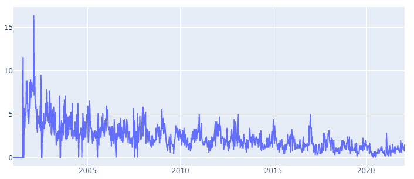
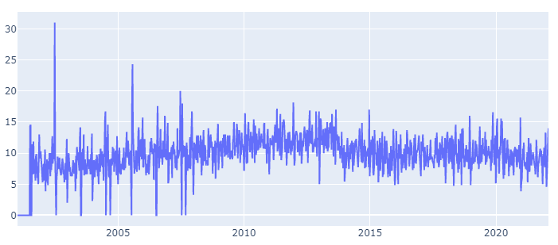
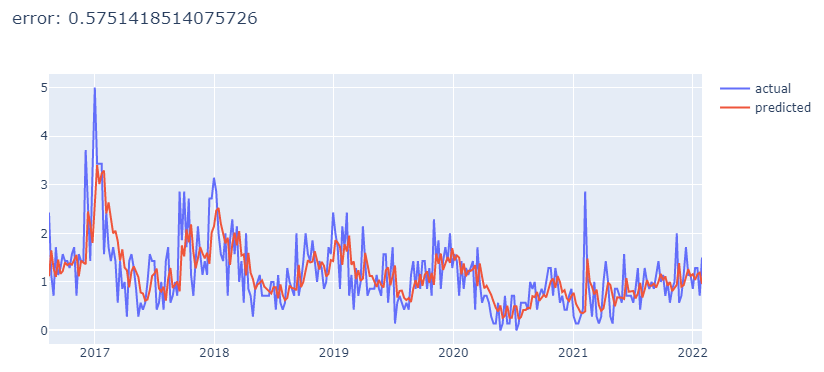
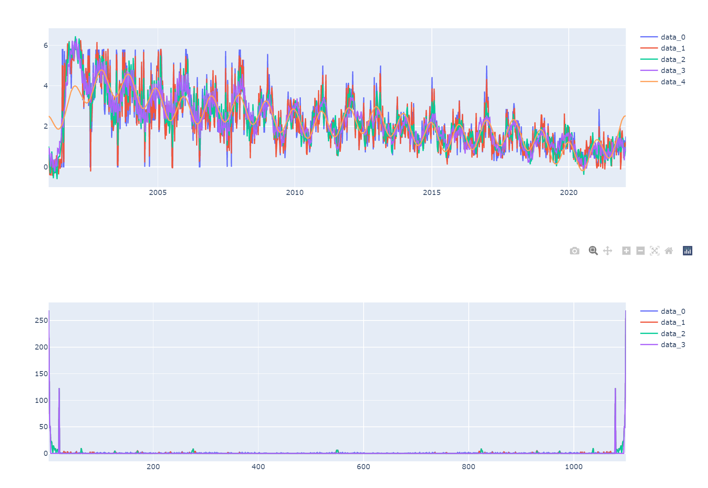
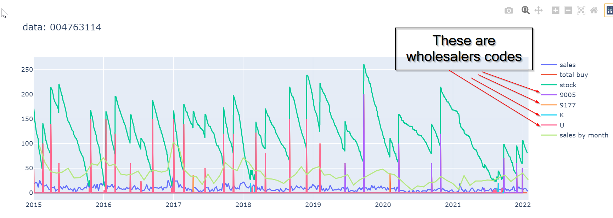
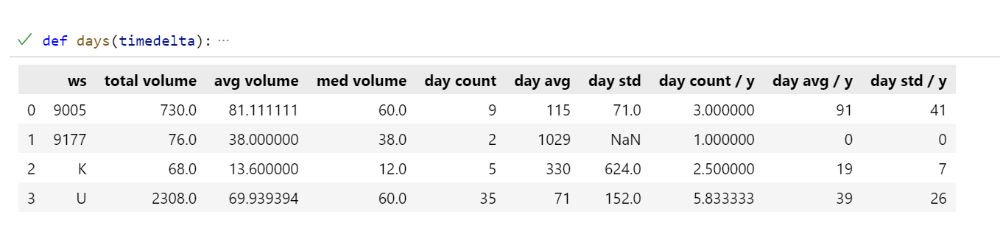
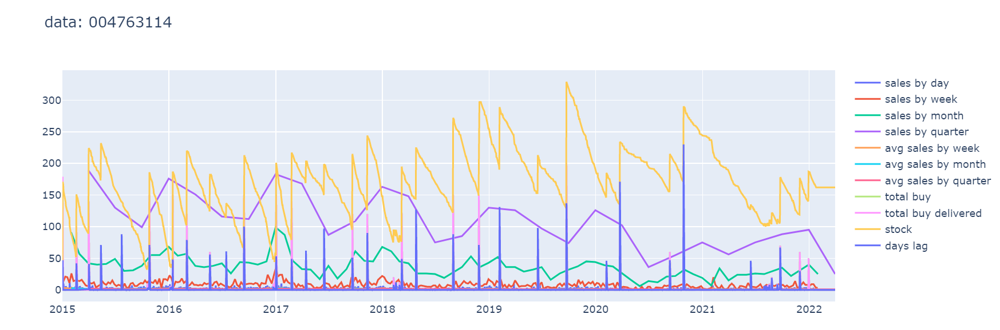

# Understanding the data

Those are sales and buys of a selection of products from a single pharmacy.
You find the data, in CSV format in the folder [`data`](./data/).

The cryptic names are because the CSVs are direct conversions from COBOL records (done with [Pycture](https://github.com/Studiofarma/pycture))

## Files

 * **orstd-XXXXXXXXX.csv**: buy files. XXXXXXXXX stands for the MinSan code of the product. MinSan is an Italian codification that uniquely identifies a medicine. It is usually printed on a barcode label applied to the medicine packaging.
 * **statava-XXXXXXXXX.csv**: sales files. XXXXXXXXX is the same as above. There is the exception of codes A0420030101 and X0144010101 that contains an **entire category of products**. For example Minsan 004763114 is a member of category A0420030101, while 024840074 is in category X0144010101. Both products present high correlation with the respective category.

# Data files most used up to now and data setup

The time series are the **average daily sales** of a product, **aggregated by week**. We want to build a model that can forecast the average daily sales, one week in the future.

Products `004763114` and `024840074` are the most used for tests. They present some peculiar features.
 - `004763114` presents a **down trend** a high **yearly seasonality**. `004763114` is an ASPIRINA, then it relates to flu trends
    
 - `024840074` does NOT presents any particular seasonality, nor any trend. `024840074` is CARDIOASPIRIN.
    

 ## Fields mapping

 ### Orstd

```
rec-orstd.orstd-key.orstd-ordine           --> Type of wholesaler. "D" stands for direct order to the manufacturer. Blank " " is a regular order to the wholesaler

rec-orstd.orstd-key.orstd-tempo.orstd-data --> Date in yyyyMMdd format

rec-orstd.orstd-key.orstd-tempo.orstd-ora  --> hour hhmmss format

rec-orstd.orstd-key.orstd-fornitore        --> wholesaler code (useful to find the historically preferred wholesaler)

rec-orstd.orstd-key.orstd-tipo-ordine      --> Not interesting

rec-orstd.orstd-key.orstd-tipo-riga        --> Not interesting

rec-orstd.orstd-key.orstd-codice-minsan    --> minsan code

rec-orstd.orstd-dati.orstd-descrizione     --> description

rec-orstd.orstd-dati.orstd-qta             --> quantity in the original order

rec-orstd.orstd-dati.orstd-qta-cons        --> quantity actually delivered. It can differ from the quantity originally ordered for reasons that I will skip for now. If you want to estimate the stock, you must use this field

rec-orstd.orstd-dati.orstd-costo           --> unit price at the moment of the order
```

### Statava

```
vb.vb-key.vb-data                                  --> Date in yyyyMMdd format

vb.vb-ora                                          --> hour hhmmss format

vb.vb-dati.vb-tipo-v                               --> type of sale. If it contains “-” you must consider the value in quantity as negative, as it is a return. You must exclude the row if it contains “r” (It is the pick up of a booked product).

vb.vb-dati.vb-codice-minsan                        --> minsan

vb.vb-dati.vb-qta                                  --> quantity sold

vb.vb-dati.vb-dati-sospeso.vb-qta-sosp             --> must add this quantity to the quantity sold. It compensate the quantity excluded by “r” sales type.

vb.vb-dati-anagrafici-prodotto.vb-principio-attivo --> active principle

vb.vb-dati-anagrafici-prodotto.vb-gmk              --> a kind of categorization

vb.vb-dati-anagrafici-prodotto.vb-bd-category      --> another kind of categorization

```

# Scripts and Notebooks

## Install requirements

```
python -m venv .venv
(for Windows) .\.venv\Scripts\activate
(for Linux)   source .venv/bin/activate
pip install -r requirements.txt
```

Requirements also install jupyter notebook environment. You can start it from a console with the command:
```
jupyter notebook
```

## Development environment (Vs Code)

I use Visual Studio code with the official Python and Jupyter notebook plugins.

- [Python](https://marketplace.visualstudio.com/items?itemName=ms-python.python)
- [Jupyter](https://marketplace.visualstudio.com/items?itemName=ms-toolsai.jupyter)
- [Jupyter Keymap](https://marketplace.visualstudio.com/items?itemName=ms-toolsai.jupyter-keymap)
- [Jupyter Notebook Renderers](https://marketplace.visualstudio.com/items?itemName=ms-toolsai.jupyter-renderers)

If you don't want to install the full environment, some Jupyter notebooks are provided to be run standalone.

Start the notebook server from a command line (after installing [requirements](#install-requirements)) with:
```
jupyter notebook
```

## Scripts

The scripts contains some analysis useful to enter the topic and see how sales and buys relate each other.

Notebooks are the exports of the corresponding scripts. Are there **if you don' want to install the full VsCode environment**.

## Comments at the head of the Scripts

at the begin of each script you find a list of commented products like the following:

```
minsan = '004763114' # ASPIRINA C*10CPR EFF 400+240MG
# minsan = 'A0420030101' # BD Category (fever and cold) (aspirina correlates to this)
# minsan = 'X0144010101' # BD Category (medicine under prescription)
# minsan = '024840074' # CARDIOASPIRIN*30CPR GAST 100MG it presents regular purchase pattern
# minsan = '011782012' # medicine SINTROM*20CPR 4MG
# minsan = '023853031' # CEFAZOLINA TEVA*IM 1F 1G+F 4ML
# minsan = '031981311' # PANTORC*14CPR GASTR 40MG
# minsan = '036635011' # DIBASE*OS GTT 10ML 10000UI/ML
# minsan = '024402051' # EUTIROX*50CPR 75MCG
# minsan = '016366027' # COUMADIN*30CPR 5MG
```

Uncomment a code to run the analysis on the corresponding product.

### `data.py`

[`common/data.py`](./common/data.py) contains useful functions to read sales and buys with resampling by week, month etc. It is used in the other scripts.

Sales functions also applies the correction to sales rows mentioned in the above section [Statava](#Statava) (`vb.vb-dati.vb-tipo-v` and `vb.vb-dati.vb-dati-sospeso.vb-qta-sosp`).

### `baseline.py`

It contains the baseline calculation used to establish how good a model is.



The baseline is a weighted average of the previous week average daily sales, previous month average daily sales and the previous quarter average daily sales. See [baseline.py](baseline.py)

### `sales_correlations.py`

 - boxplot outliers analysis
 - outliers removal
 - plots the entire time-series aggregated by week, month, quarter and four months.
 - plot the day of the week average sale analysis
 - Fourier components analysis
 - Autocorrelation and Partial Autocorrelation by day, week, month , quarte and quad.



### `product_insights.py`

It analyzes sales compared to buys and uses `buys - sales` over time to plot the stock trend.

It plots total buys and buys by wholesaler. It is useful to find if there is a preferred wholesaler.



It also compute an analysis per wholesaler.



### `days_of_coverage.py`

The main analysis here is to plot how many days passes between one order and the other. The purpose is to have an idea of the historically desired coverage for the given product.


